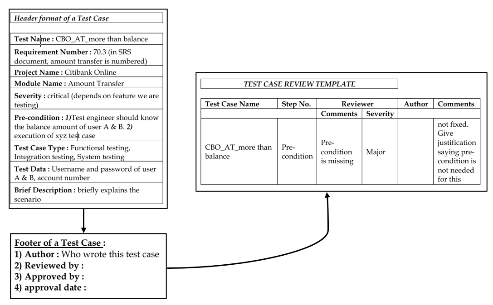

## TEST CASES
* Test case is a document which covers all possible scenarios to test all the feature(s).
* A test case is a structured document that defines:
  * What to test
  * How to test
  * Expected result
* It helps testers verify that a feature works as expected and ensures consistency in testing.
___
### Why we write test cases? 
* **To have better test coverage** – cover all possible scenarios and document it, so that we need not remember all the scenarios 
* **To have consistency in test case execution** – seeing the test case and testing the product 
* **To avoid training every new engineer on the product** – when an engineer leaves, he leaves with lot of knowledge and scenarios. Those scenarios should be documented, so that new engineer can test with the given scenarios and also write new scenarios.  
* **To depend on process rather than on a person** 

___
### STANDARD TEST CASE TEMPLATE

| Column Name               | Description                                      |
|---------------------------|--------------------------------------------------|
| **Test Case ID**          | Unique identifier (e.g., TC_001)                 |
| **Test Scenario / Title** | High-level description of what is being tested   |
| **Pre Conditions**        | Conditions that must be met before execution     |
| **Test Steps**            | Step-by-step actions to execute the test         |
| **Test Data**             | Input values required for testing                |
| **Expected Result**       | Expected system behavior/output                  |
| **Actual Result**         | Actual outcome after execution                   |
| **Status**                | Pass / Fail                                      |
| **Priority**              | Importance (High/Medium/Low)                     |
| **Severity**              | Impact of defect if fails (critical,major,minor) |
| **Environment**           | Testing environment (QA, UAT, Prod-like)         |
| **Test Type**             | Functional / Regression / Smoke etc.             |
| **Executed By**           | Tester name                                      |
| **Execution Date**        | When test was executed                           |
| **Comments / Remarks**    | Additional notes                                 |

### TEST CASE DESIGINING TECHNIQUES
