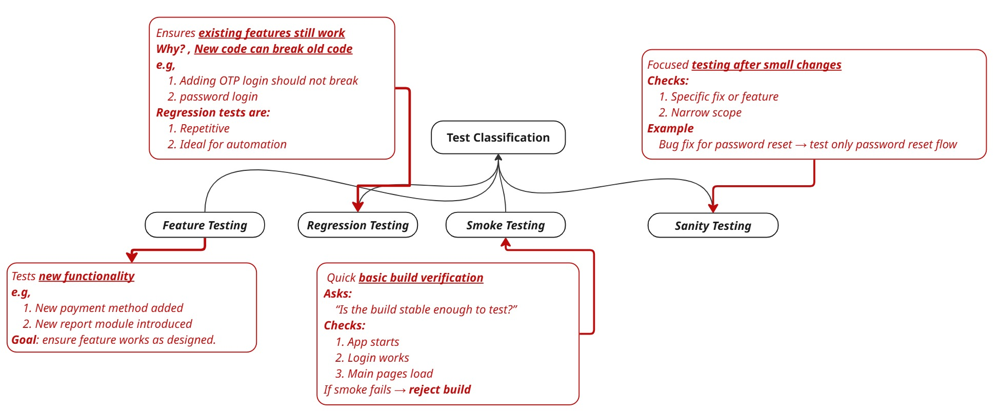

### 1.  SOFTWARE TESTING
* _Software testing ensures that an application works as expected, meets user requirements, and fails safely when something goes wrong._
#### 1.1 TESTING DIMENSIONS
  1. _Type of Testing (What we test)_ 
  2. _Levels of Testing (When/Where we test)_
  3. _Test Classification (Why we test)_
___

### 2. TYPE OF TESTINGS
* _Functional Testing_
* _Non-Functional Testing_

___
### 3. LEVELS OF TESTING

### 4. TEST CLASSIFICATION

#### 4.1 SMOKE VS SANITY TESTING

| Aspect  | Smoke           | Sanity           |
| ------- | --------------- | ---------------- |
| Scope   | Broad           | Narrow           |
| When    | New build       | After minor fix  |
| Purpose | Build stability | Fix verification |
| Depth   | Shallow         | Deep             |

### 5. MANUAL TESTING TYPES
| Criteria             | White Box                                 | Black Box               | Gray Box                         |
| -------------------- |-------------------------------------------| ----------------------- | -------------------------------- |
| Code Knowledge       | Full                                      | None                    | Partial                          |
| Who Performs         | Developers                                | Testers                 | Testers (technical)              |
| Focus                | Internal logic                            | External behavior       | Both                             |
| Programming Required | Yes                                       | No                      | Some                             |
| Testing Level        | Unit Testing                              | System/Acceptance       | Integration/System               |
| Techniques           | Path coverage, Branch coverage, loop Test | BVA, EP, Decision table | API testing, DB validation       |
| Main Goal            | Code correctness                          | Functional correctness  | Functional + Internal validation |
#### 5.1 ANALOGY
* Black Box → Drive the car and see if it works
* White Box → Open engine and check internal components
* Gray Box → Drive car + check engine diagnostics